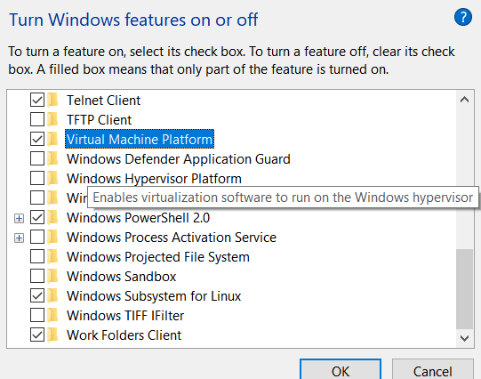
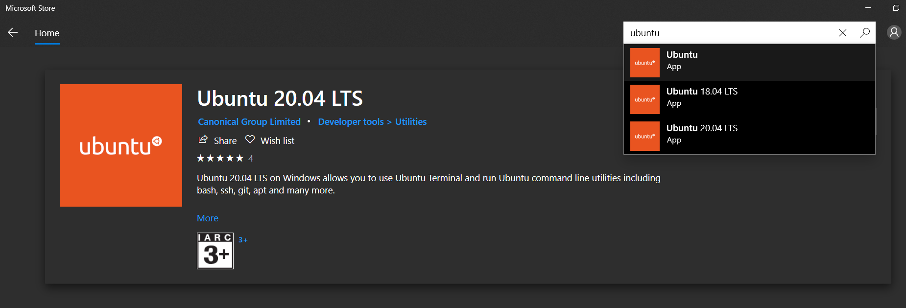
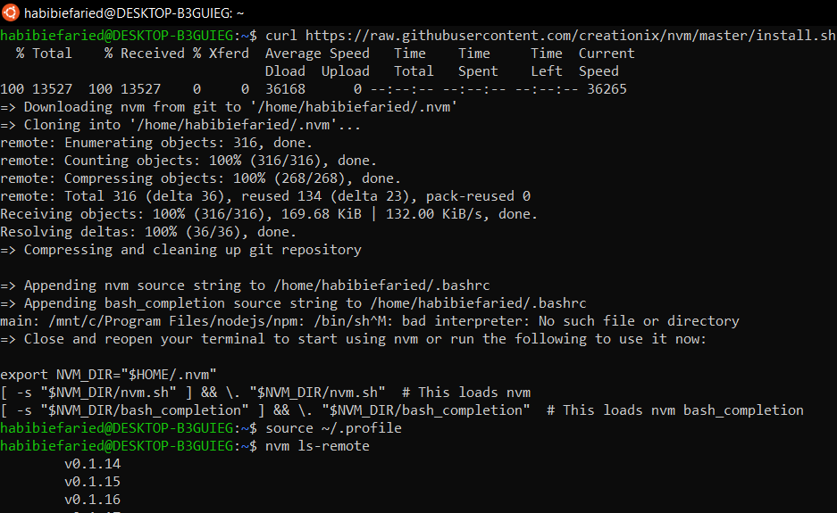
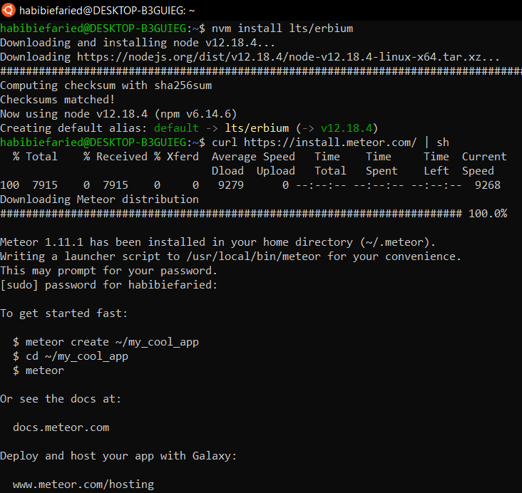
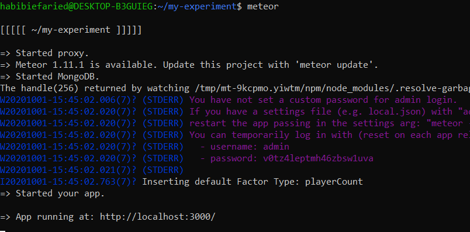

# Installation

* Please refer to this guide to install WSL2. https://docs.microsoft.com/en-us/windows/wsl/install-win10. Don't forget to turn on `Virtual Machine Platform` and `Windows Subsystem for Linux`. 



* After WSL installation is done, go to App Store, search for Ubuntu 20.04, and install it.



* Then, you can launch terminal from there, do some setup.


* Install NVM using script. Please refer to this guide: https://tecadmin.net/install-nodejs-with-nvm/



* Continue to meteor installation



* After all installation are done and successful, as stated on https://empirica.ly/docs/quick-start.html. You can issue commands

```
npx create-empirica-app my-experiment
cd my-experiment
meteor
```



