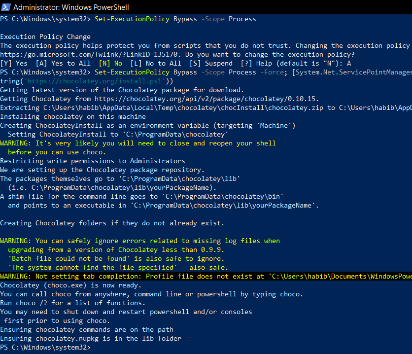

# Installation

1. Open Powershell as Administrator. Click start and type *PowerShell*, and then right click on that and choose *Run as Administrator*


2. Run these commands as stated on https://chocolatey.org/docs/installation

```
Set-ExecutionPolicy Bypass -Scope Process

Set-ExecutionPolicy Bypass -Scope Process -Force; [System.Net.ServicePointManager]::SecurityProtocol = [System.Net.ServicePointManager]::SecurityProtocol -bor 3072; iex ((New-Object System.Net.WebClient).DownloadString('https://chocolatey.org/install.ps1'))

```



