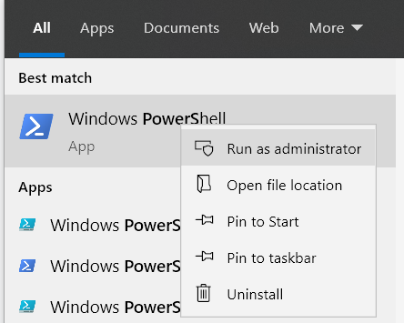
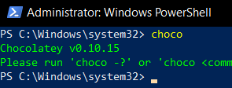
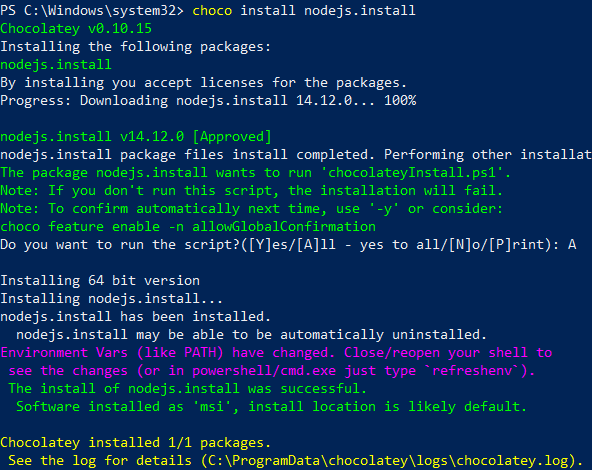

# Installation

1. Open Powershell as Administrator. Click start and type *PowerShell*, and then right click on that and choose *Run as Administrator*



2. Run these commands as stated on https://chocolatey.org/docs/installation

```
Set-ExecutionPolicy Bypass -Scope Process

Set-ExecutionPolicy Bypass -Scope Process -Force; [System.Net.ServicePointManager]::SecurityProtocol = [System.Net.ServicePointManager]::SecurityProtocol -bor 3072; iex ((New-Object System.Net.WebClient).DownloadString('https://chocolatey.org/install.ps1'))

```


3. After installation is done, powershell needs to be closed, and re-opened again as admin (step 1). If it's successful, issue `choco` and It will show you the version



4. Install nodejs by issuing command `choco install nodejs.install`. After it's done, then you need to close and re-open powershell (step 1)



5. Install meteor by issuing command `choco install meteor`. After it's done, then you need to close and re-open powershell (step 1)

[!Meteor Installation](5.png)

6. Check all required software.

[!Checking](6.png)

7. This step is *optional*, but It's good to turn off any firewall or AV right now. It's proven that, they are able to interfere this process. Go to firewall and turn it off.

[!Firewall turned off](7.png)

8. Choose the path where you want to install the experiment. In this case, I would be using `C:\Users\Default`. As stated on https://empirica.ly/docs/quick-start.html. We can issue this commands

```
npx create-empirica-app my-experiment
cd my-experiment
meteor
```

[!Run empirica](8.png)

9. If it's running, then you can access this on http://localhost:3000

[!Empirica Running](9.png)

