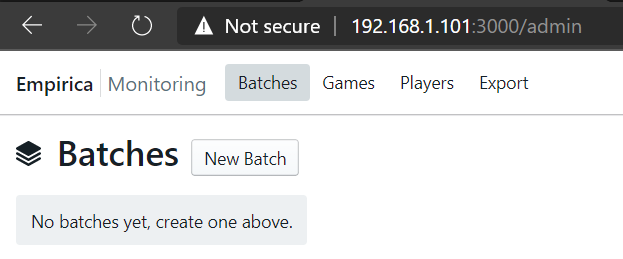

# Installation

## Docker installation (Windows)

Please refer to this guide: https://docs.docker.com/docker-for-windows/install/

## Step

1. First, build the image using this command

```
docker build . -t empirica/dev
```

2. Run your first app

```
docker run -dit -p 3000:3000 --name empiricadev empirica/dev
```

3. If you get this error

```
docker: Error response from daemon: Conflict. The container name "/empiricadev" is already in use by container "ba6b63744a1d239d6092ac2012654a0491cdc37d708b1fcfa23ee158ba07c864". You have to remove (or rename) that container to be able to reuse that name.
```

Then issue this command to remove existing container

```
docker rm -f empiricadev
```

4. After you run the container, you might want to see the logs to gain admin login.

```
# docker logs empiricadev
[[[[[ ~/my-experiment ]]]]]

=> Started proxy.
=> Meteor 1.11.1 is available. Update this project with 'meteor update'.
=> Started MongoDB.
W20201001-03:22:19.020(0)? (STDERR) You have not set a custom password for admin login.
W20201001-03:22:19.034(0)? (STDERR) If you have a settings file (e.g. local.json) with "admins" configured, you can
W20201001-03:22:19.034(0)? (STDERR) restart the app passing in the settings arg: "meteor --settings local.json".
W20201001-03:22:19.035(0)? (STDERR) You can temporarily log in with (reset on each app reload):
W20201001-03:22:19.035(0)? (STDERR)   - username: admin
W20201001-03:22:19.035(0)? (STDERR)   - password: ca1fkeeajco1ad1qqhxyao
W20201001-03:22:19.035(0)? (STDERR)
I20201001-03:22:19.715(0)? Inserting default Factor Type: playerCount
=> Started your app.

=> App running at: http://localhost:3000/
```

5. Now, access `http://<your docker host IP>:3000/`. If it's on local, then it should be `localhost:3000`. 



6. Take a note that, the code is inside the container right now. You need to copy that to your host machine in order to edit it.


```
docker cp empiricadev:/home/node/my-experiment ~/code
```

7. Now you can remove current working container, and replace it like this

```
docker rm -f empiricadev
docker run -dit -p 3000:3000 -v ~/code:/home/node/my-experiment --name empiricadev empirica/dev
```

8. 