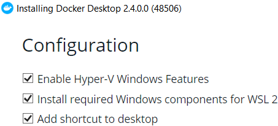

# Installation

## Docker installation (Windows)

Please refer to this guide: https://docs.docker.com/docker-for-windows/install/. Take a look at notes below:

* You have to make sure that you install WSL 2 on Windows. Before going to docker installation, make sure the `Install required components for WSL2` option is available.



* Open microsoft store, look for Ubuntu 20.04, and install it. 


* Launch the terminal and setup the password, up to this point. Your ubuntu is on ready state


* Open docker settings, go to *resources* then *WSL Integration*. Click to enable WSL integration and choose the OS, in this case, Ubuntu 20.04


Then click apply & restart

* You can relaunch the terminal and issue `docker` command. It should be ready.

## Run Empirica

1. First, build the image using this command

```
docker build . -t empirica/dev
```


2. Run empirica image

```
docker run -dit -p 3000:3000 --name empiricadev empirica/dev
```

*If you get this error*

```
docker: Error response from daemon: Conflict. The container name "/empiricadev" is already in use by container "ba6b63744a1d239d6092ac2012654a0491cdc37d708b1fcfa23ee158ba07c864". You have to remove (or rename) that container to be able to reuse that name.
```

Then issue this command to remove existing container

```
docker rm -f empiricadev
```

3. After you run the container (It may take 5 minutes), you might want to see the logs to gain admin login.


4. Now, access `http://<your docker host IP>:3000/`. If it's on local, then it should be `localhost:3000`. 


## Run Empirica with code in host system

1. Take a note that, the code is inside the container right now. You need to copy that to your host machine in order to edit it.


```
docker cp empiricadev:/home/node/my-experiment ~/code
```

2. Now you can remove current working container, and replace it like this

```
docker rm -f empiricadev
docker run -dit -p 3000:3000 -v ~/code:/home/node/my-experiment --name empiricadev empirica/dev
```

Screenshot below is this whole operation.


